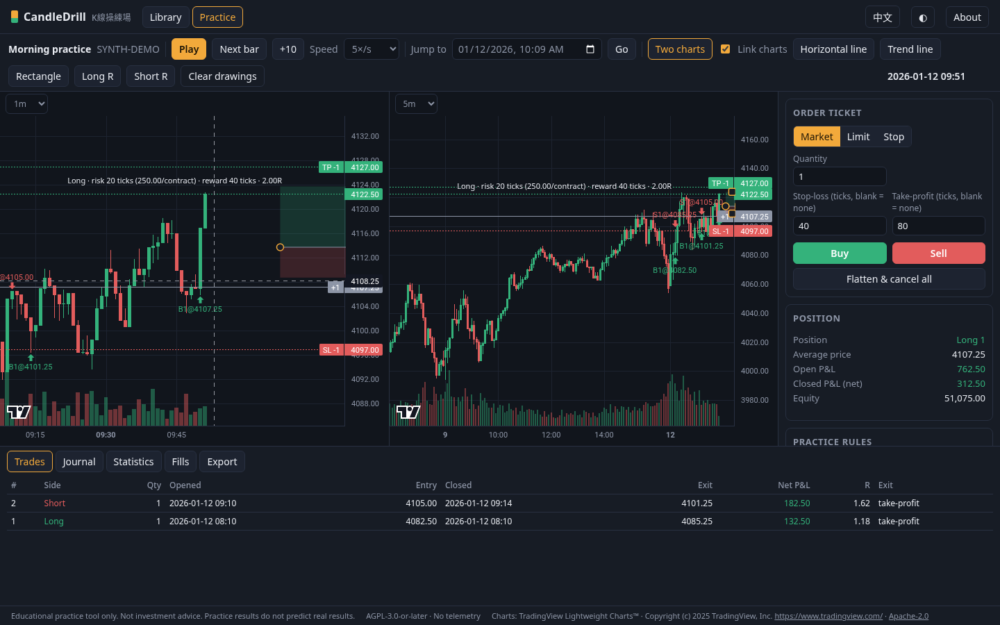

# CandleDrill

**CandleDrill** (Chinese name: **K線操練場**) is a free, open-source, self-hosted
candlestick **replay practice tool**. Load price bars, step through them one candle
at a time without seeing the future, place simulated orders, and review your
results. Everything runs on your own computer, with no account, no subscription and
no telemetry.

> **Status: v0.2.7.** Free local practice tool. Expect rough edges; please report bugs
> in the issue tracker. See the [CHANGELOG](CHANGELOG.md) for what changed.



<sub>Screenshot uses generated `SYNTH-` demo data, not real market prices.</sub>

Hands-on guide in Traditional Chinese: [docs/guide.zh-Hant.md](docs/guide.zh-Hant.md).

## Beginner install（新手安裝）

You only need a desktop computer (macOS, Windows or Linux), a browser, and about five minutes.
No account, no Docker required for the default path.

1. **Install Node.js 22 or newer** from [nodejs.org](https://nodejs.org/) (LTS is fine).  
   After installing, open a terminal and check: `node -v` (should show `v22` or higher).
2. **Download CandleDrill** (pick one):
   - With Git: `git clone https://github.com/Kinfxhk/candledrill.git` then `cd candledrill`
   - Or download the ZIP from GitHub → **Code → Download ZIP**, unzip, and `cd` into the folder
3. **Install dependencies once:** `npm ci`  
   (No C++ build tools needed; SQLite comes as a prebuilt binary.)
4. **Start the app:** `npm start`
5. **Open in your browser:** <http://127.0.0.1:4870/>  
   Click **Generate demo data**, fill in the session form, then **Start practising**.

Data stays on your machine (`~/.candledrill/candledrill.db`). Prefer Docker? See [Quick start → Docker](#docker) below.  
中文逐步說明見 [使用教學：安裝](docs/guide.zh-Hant.md#安裝四行指令)。

## Risk notice

CandleDrill is an **educational practice tool**. It is **not investment advice**,
it gives no trading signals, and **simulated or practice results do not predict
real trading results**. Trading futures, forex and other leveraged products can
lose more than your deposit. Bar-based simulation cannot know the true order of
prices inside a bar; CandleDrill will always state the assumptions it uses.

## Why

Bar-replay and manual backtesting are mostly sold as monthly subscriptions.
CandleDrill aims to provide the core practice workflow as free software that
anyone can install once and run locally forever.

CandleDrill is an independent project and is **not affiliated with, endorsed by,
or sponsored by FX Replay, Forex Tester, TradeZella or TradingView** (or any broker,
exchange, data vendor or prop firm). Those names are trademarks of their
respective owners and appear here only for plain factual comparison.

## Commitments

- **Free forever.** No paid tiers, no feature unlocks, no trial timers, no limits on
  how many sessions, bars or trades you practise.
- **No ads, no tracking, no account.** Nothing is sent anywhere; there is nothing to
  sign up for.
- **Your data stays yours.** One SQLite file on your disk, a one-click backup file,
  and a documented way to restore it (see [Your data](#your-data)).
- **Works on macOS, Linux and Windows** (Node.js 22+ or Docker). Windows is tested in
  CI on every change. **Use a desktop browser.** The layout is not meant for a phone
  window (about 390px wide); a narrow window used to let the About button stick out.
- **No broker connection, ever.** Practice only; the app never asks you to link an
  account.
- **Honest simulation.** Fill rules and their limits are written down
  ([docs/FILL-MODEL.md](docs/FILL-MODEL.md)); nothing is presented as more precise
  than bar data allows.
- **Removals are announced.** Any feature removal is marked deprecated for one
  release first and listed in the CHANGELOG; every release keeps a reproducible
  source archive so you can stay on an older version.

## Principles

- **Self-hosted, local-only.** The server binds to `127.0.0.1` only and refuses
  any other address. The one exception is the container image, which listens on
  `0.0.0.0` inside the container and must be published on the host's `127.0.0.1`
  (see Docker below). Your data stays in a local SQLite file
  (default `~/.candledrill/candledrill.db`).
- **No telemetry.** No analytics, no tracking, no phoning home.
- **No bundled market data.** The demo uses a deterministic **synthetic** data
  generator (symbols always start with `SYNTH-`). You import data you are
  entitled to use.
- **No broker connections, no real orders.** Practice only.
- **Clean-room.** Built from written feature descriptions only; no code, UI,
  icons or text copied from any commercial product. See
  [CONTRIBUTING.md](CONTRIBUTING.md).

## Features

- **Data library**: CSV import with a column-mapping dialog (delimiter, header,
  timestamp format and time zone detection, preview), strict validation (OHLC
  consistency, duplicates, ordering) with a row-level report. A deterministic
  synthetic generator makes demo data in one click.
- **Replay without look-ahead**: step one bar, ten bars, play at 1–120 bars/s,
  jump forward to a date. The server keeps the full series, and a practice session
  only ever receives bars up to the replay cursor. Note: the data library shows a
  preview of the dataset (its most recent bars) before you start, so in a normal
  session this guards against accidental look-ahead, not against reading your own
  data. Blind practice (below) also hides that preview.
  See [What "no look-ahead" covers](docs/FILL-MODEL.md#what-no-look-ahead-covers).
- **Blind practice** (new in 0.2): tick **Blind practice** in the session form. The
  start point is chosen at random (20–80% into the data), the symbol is shown as
  `BLIND`, dates are moved by a random whole number of weeks (5–30 years, so weekday
  and time of day stay true) and prices by a random whole number of ticks (so P&L and
  R are unchanged). The dataset's preview is locked while the blind session runs.
  **Reveal** (or finishing the session) shows the real symbol, dates and prices. The
  disguise stops casual recognition; it is not a cryptographic guarantee: a very
  distinctive price pattern can still be recognised, and anyone with access to your
  computer can read the database.
- **Timeframes**: 1m, 5m, 15m, 1h and daily, aggregated from the revealed bars
  only (a forming higher-timeframe bar never shows the future). Two-chart split
  view for multi-timeframe practice.
- **Simulated orders**: market, limit, stop; bracket orders with stop-loss and
  take-profit (OCO); atomic modify (re-validated, logged) and cancel; flatten all. Commission per contract and
  slippage in ticks.
- **Positions and P&L**: average price, open and closed P&L, equity, trade log,
  fills, markers and order lines on the chart.
- **Statistics**: win rate, expectancy, profit factor, average R-multiple, max
  drawdown, streaks and more. Export trades to CSV, a self-contained HTML report,
  or session JSON.
- **Practice rules** (optional): daily loss limit, trailing drawdown, profit
  target. A breach or target hit closes positions and locks trading for that
  session, so you can rehearse a rule-based routine.
- **Drawings**: horizontal and trend lines, rectangles, and a **long/short R tool**
  (entry, stop and target with the live risk:reward ratio, default stop 20 ticks and
  target 40 ticks). Select a drawing to drag it or its handles; **Delete** or the ×
  button removes it. Saved with the session.
- **Linked charts** (split view): the crosshair is mirrored on the other timeframe and
  scrolling one chart keeps the other aligned to the same right-hand time. Untick
  **Link charts** to move them independently.
- **Trade journal**: tags (up to 8) and a note per trade, saved automatically;
  bar-based MAE/MFE in ticks and in R; results grouped by exchange-local hour and
  weekday. Tags and notes are included in the trades CSV and session JSON.
- **Sessions** are saved automatically in a local SQLite file; resume any time.
  **Import session file** loads an exported session JSON back, after checking it against
  the dataset (see [Your data](#your-data)).
- **UI**: English and 繁體中文, dark and light themes, keyboard shortcuts
  (Space play/pause, → next bar, Shift+→ ten bars, B buy, S sell, F flatten,
  Esc cancel drawing).

## How fills are simulated

Bar data cannot tell what happened inside a bar, so CandleDrill uses fixed,
conservative rules, shows them in the app, and records the engine and fill-model
version (currently **fill model v3**) in every report. Full details and limitations:
[docs/FILL-MODEL.md](docs/FILL-MODEL.md).

- Orders only fill on bars revealed **after** they were placed.
- Market orders fill at the next bar's open plus slippage.
- Limit orders fill at their price, or at the open if price gaps through it. A limit
  already at or through the last price is rejected (a buy at or above it, a sell at
  or below it); it would otherwise fill at the next open.
- Stop orders fill at their price, or at the open if gapped, plus slippage.
- Bracket stop-loss/take-profit orders follow the same rules from the moment the
  entry fills: if the open gaps through them, they fill at the open, never at a price
  outside the bar.
- If one bar touches both the stop-loss and the take-profit, the **stop-loss is
  assumed to fill first**.
- Drawdown and practice rules are evaluated on each bar's close. The profit target
  counts only **after estimated exit commission and slippage**.
- At the end of the data an open position **stays open**, valued at the last close.
  Working orders are cancelled and Flatten is disabled, because there is no later bar.
- R-multiples use the stop-loss risk of every entry; R is **N/A** if any entry had no
  stop-loss.
- MAE/MFE in the journal are measured from bar highs and lows between entry and exit,
  so they are upper bounds: the true order of prices inside a bar is unknown.
- An independent Python re-implementation (`tools/oracle/`) re-checks thousands of
  random sessions against these rules in CI: fills, P&L, commission, R, MAE/MFE,
  blind-mode disguise and leakage, and backup round trips.

## Your data

- **Where it lives:** one SQLite file, by default `~/.candledrill/candledrill.db`
  (Windows: `%USERPROFILE%\.candledrill\candledrill.db`). Change the folder with
  `CANDLEDRILL_DATA_DIR` or the file with `CANDLEDRILL_DB`. In Docker it lives in the
  `candledrill-data` volume.
- **Backup:** **Back up everything** in the data library downloads a complete copy of the
  database (`candledrill-backup-YYYYMMDD-HHMMSS.db`): datasets, bars, sessions,
  drawings and journal. You can also copy the `.db` file while CandleDrill is stopped.
  After a few changes without a recent backup the app shows a reminder card; it can be
  dismissed for 14 days and never sends anything anywhere.
- **Restore:** **Restore from backup** replaces the whole library with a backup file
  after you confirm. The file is first checked read-only (SQLite integrity check,
  only CandleDrill's own tables and indexes, no triggers or views, a known schema
  version, valid JSON), older backups are upgraded on a copy, and the swap happens in
  one transaction. The previous library is kept next to it as
  `candledrill.db.before-restore-<timestamp>` so a mistaken restore can be undone by
  copying that file back while CandleDrill is stopped.
- **Session files:** **Export → Session JSON** saves one session; **Import session file**
  loads it into a library that has the same dataset. The file carries a SHA-256
  fingerprint of the bars and the import refuses a dataset whose bars differ. Every
  fill is re-checked against the bar it claims (time revealed, price within the bar
  plus slippage), and the commission total and position must match the fills.
  Limitation: files exported by 0.1.x carry no fingerprint, so CandleDrill asks you to
  pick the dataset; such a file can pass against a different dataset that happens to
  have the same bar times and compatible prices.
- **Browser storage is not used for data.** The browser only keeps UI preferences
  (theme, language, linked charts, the backup-reminder counter), so clearing it loses
  nothing important.

## Performance and limits

Measured with `npm run bench` and `scripts/bench-browser.ts` on **500,000 synthetic
1-minute bars** (about four years of day sessions) on an 8-vCPU Linux VM; machine, method
and full table in [docs/PERFORMANCE.md](docs/PERFORMANCE.md):

- CSV import of all 500,000 bars: about 2.5 s; database 23 MiB.
- Opening a session at bar 400,000: about 1.8 s to a drawn chart in the browser.
- Stepping one bar: under 1 ms in the engine; about 65 ms median click-to-redraw in the
  browser (one chart or split view).
- Backup 0.3 s, restore 0.9 s.

Limits: up to 1,000,000 bars (96 MiB) per CSV import; the browser holds the most recent
50,000 revealed bars of a session, so speed does not degrade with longer data, but you
cannot scroll back further than that inside a session.

## Quick start

Requirements: [Node.js](https://nodejs.org/) 22 or newer and npm.

```bash
git clone https://github.com/Kinfxhk/candledrill.git
cd candledrill
npm ci
npm start            # builds the UI and serves it at http://127.0.0.1:4870/
```

Then open <http://127.0.0.1:4870/>, click **Generate demo data** (or **Import
CSV**), fill in the session form and press **Start practising**.

Your data is stored in `~/.candledrill/candledrill.db`. Settings via environment
variables: `CANDLEDRILL_PORT` (default 4870), `CANDLEDRILL_DATA_DIR`,
`CANDLEDRILL_DB`, `CANDLEDRILL_LOG_LEVEL` (default `warn`). `CANDLEDRILL_HOST` may
only be `127.0.0.1`. No C++ build tools are needed: the repository's `.npmrc` skips
install scripts and the SQLite driver ships prebuilt binaries.

### Docker

```bash
docker compose up --build    # http://127.0.0.1:4870/
```

`compose.yaml` publishes the port on the host's **127.0.0.1 only** and keeps data
in the `candledrill-data` volume. Inside the container the server listens on
`0.0.0.0` (allowed only when `CANDLEDRILL_CONTAINER=1`, which the image sets) so
Docker can forward the port. With plain Docker, always bind to loopback:
`docker run -p 127.0.0.1:4870:4870 -v candledrill:/data candledrill`. CandleDrill
has no login, so never expose it to a network.

### CSV format

One row per bar with a timestamp, open, high, low, close and (optional) volume.
Column names, order and delimiter are flexible: the import dialog guesses the
mapping and lets you correct it. Timestamps may be ISO 8601 (with or without a
zone), `YYYYMMDD HHMMSS`, day- or month-first dates, or Unix seconds/milliseconds.
Times without a zone are interpreted with the UTC offset you choose. Only import
data you are entitled to use; CandleDrill ships no market data.

## Development

```bash
npm run check          # lint, format, typecheck, unit/property/golden tests,
                       # licence allowlist, no-market-data + attribution, secret scan
npm run dev:server     # API on http://127.0.0.1:4870
npm run dev:web        # Vite dev server on http://127.0.0.1:4871 (proxies /api to 4870)
npm run test:e2e       # headless browser smoke test (Playwright)
```

`npm run test:e2e` needs a Chromium: run `npx playwright install chromium` once,
or point to an installed browser with `PW_CHROMIUM_PATH=/usr/bin/google-chrome`.
`npm run screenshot` regenerates `docs/screenshot.png` against a running server.

## Repository layout

```
packages/core     Pure TypeScript engine (no I/O, no clock): data model, CSV import,
                  aggregation, replay, order matching, accounting, stats, rules, export
packages/server   Fastify + SQLite local server (127.0.0.1 only)
packages/web      Browser UI (vanilla TypeScript + Lightweight Charts™)
e2e/              Playwright smoke test
scripts/          Licence allowlist, secret scan, no-market-data/attribution checks
docs/             Licensing record, fill model, performance notes, screenshot
tools/oracle/     Independent Python re-checks of the engine and server (stdlib only)
```

## Synthetic data

The demo generator produces 1-minute bars that look like an intraday market
(volatility clustering, busier open and close, session gaps, tick-rounded prices)
but are **entirely made up**; symbols always start with `SYNTH-`. Same seed gives
byte-identical output, guarded by a golden snapshot test.

## Roadmap

Still planned (see [CHANGELOG](CHANGELOG.md)): a command queue with stale-response
protection, numeric order modification with a risk preview, toolbar and panel
improvements, better CSV data-quality reporting, intrabar rule checks, an optional
fixed-spread cost model, and an `npx` package. Daylight-saving-aware (IANA) session
calendars are deliberately postponed: blind practice relies on whole-week time shifts
and the engine on fixed-offset trading days, and changing both safely is a larger
design change than this release.

## Privacy and security

- The server binds to `127.0.0.1` only and refuses other addresses (container
  exception above); it also rejects requests whose `Host` header is not loopback
  (DNS-rebinding defence).
- **Cross-origin protection:** every state-changing request must carry a random
  token generated at each launch (`X-CandleDrill-Token`), which only pages served by
  CandleDrill itself can read. Requests whose `Origin` is not exactly CandleDrill's own
  origin (including other localhost ports and `null`) are refused. No CORS headers
  are ever sent. Scripts on your own machine can fetch the token from
  `GET /api/token` and send it with writes.
- Strict Content-Security-Policy, no third-party requests, no analytics.
- CSV exports are protected against spreadsheet formula injection.
- **Sharing reports:** exports contain no price bars, but they do contain entry and
  exit prices, times and drawings derived from your data. Check your data provider's
  licence before publishing a report built on real market data.
- Loopback is not a sandbox: other software running on your computer can reach
  `127.0.0.1`. Do not expose CandleDrill to a network; it has no login.
- See [SECURITY.md](SECURITY.md) to report a vulnerability.

## Third-party attribution

Charts are rendered with [TradingView Lightweight Charts™](https://www.tradingview.com/lightweight-charts/)
(Apache-2.0), Copyright (с) 2025 TradingView, Inc. The required NOTICE and a link to
<https://www.tradingview.com/> are shown in the app footer and About dialog (and
the library's logo link is kept). Full list: [THIRD_PARTY_NOTICES.md](THIRD_PARTY_NOTICES.md).

## 繁體中文簡介

**K線操練場（CandleDrill）** 是一個免費、開源、在自己電腦運行的K線回放練習工具：
匯入K線後逐根前進（看不到未來K線），進行模擬落單，再檢討成績。毋須帳戶、毋須訂閱、
不收集任何使用數據。

- **介面供桌面瀏覽器使用**，不保證手機寬度（約 390px）的版面。
- **現階段**：v0.2.2。已經在最後價或穿過市價的限價單會被拒絕（買入限價高於或等於最後價、沽出限價低於或等於最後價），不會在下一根開市自動成交。v0.2.1 沿用 v0.2.0 的功能，另外：價格軸小數位跟最小跳動（0.25 顯示兩位，不再把
  4145.75 顯示成 4145.5）；中文介面翻譯規則原因、出場原因、訂單類型及練習狀態；練習規則
  註明每根K線收市才檢查；市價單止蝕由最後收市價起計；已實現盈虧註明含手續費；匯入 CSV
  時提示最小跳動預設 0.01，數據集列表會顯示該值。v0.2.0 新增：
  - **盲練**：隨機起點；代號顯示為 `BLIND`；日期移動隨機整數週（星期及時間不變），價格移動
    隨機整數個最小價位（盈虧及 R 不變）；盲練期間資料庫預覽會鎖住；按「揭曉」或完成後才顯示
    真實代號、日期及價格。只防一眼認出，並非加密保證。
  - **Session 檔匯入**（附K線 SHA-256 指紋核對，逐筆成交對回K線）及**整個資料庫備份／還原**
    （還原前先唯讀檢查，舊資料庫會另存為 `candledrill.db.before-restore-<時間>`）；有備份提醒卡。
  - **畫線工具**：矩形、長／短倉 R 工具（入場、止蝕、目標及風險回報比），可拖曳修改、刪除。
  - **雙圖連動**：十字線同步，時間軸對齊（可關閉）。
  - **交易日誌**：每筆交易可加標籤及筆記，MAE／MFE（以K線高低計，屬上限），按時段及星期統計。
  - 其他功能：CSV 匯入、練習期間不傳送未來K線的回放、多時間框架、市價／限價／止蝕單及括號單、
    持倉與盈虧、統計報告及匯出、自訂練習規則、中英介面及深淺色主題。
- **承諾**：永久免費，不設收費解鎖、等候時間或次數限制；無廣告、無追蹤、無帳戶；
  macOS、Linux、Windows 均可使用（Windows 每次改動都有自動測試）；永不連接經紀商；
  移除功能前會先標示棄用一個版本。
- **你的資料**：全部存於一個 SQLite 檔（預設 `~/.candledrill/candledrill.db`，可用
  `CANDLEDRILL_DATA_DIR` 或 `CANDLEDRILL_DB` 更改）。資料庫頁面有「備份全部」及
  「由備份還原」按鈕；瀏覽器只存介面設定，清除瀏覽器資料不會失去練習紀錄。
- **效能**：50 萬根 1 分鐘K線，匯入約 2.5 秒，在第 40 萬根開始練習約 1.8 秒見到圖表，
  逐根前進約 65 毫秒（詳見 [docs/PERFORMANCE.md](docs/PERFORMANCE.md)）。每次匯入上限
  100 萬根；瀏覽器只保留最近 5 萬根已揭示K線，所以數據再長亦不會變慢。
- **獨立核對**：`tools/oracle/` 內有一個獨立的 Python 程式，用數千個隨機練習重新計算成交、
  盈虧、佣金、R、MAE／MFE，並檢查盲練不洩漏真實資料及備份還原完全一致；CI 每次都會執行。
- **成交規則**：詳見 [docs/FILL-MODEL.md](docs/FILL-MODEL.md)（英文）。報告會列明引擎及成交
  模型版本。
- **「無未來數據」的範圍**：練習進行中只會收到游標以前的K線；但資料庫頁面在開始前會預覽數據，
  而數據本身存於本機，所以只能避免意外先見，並非防作弊。
- **分享報告**：匯出檔不含K線，但含有由數據衍生的成交價及時間；以真實行情練習時，公開前請
  先確認數據授權。
- **使用教學**（繁體中文實測）：[docs/guide.zh-Hant.md](docs/guide.zh-Hant.md)。
- **快速開始**：安裝 Node.js 22 後執行 `npm ci && npm start`，打開 http://127.0.0.1:4870/ 。
- **只在本機運行**：伺服器只綁定 `127.0.0.1`（Docker 容器內部例外地監聽 `0.0.0.0`，但只可
  發佈到本機 `127.0.0.1`），數據存於本機 SQLite 檔。所有改動數據的請求都須附上每次啟動
  隨機產生的權杖，其他網站發出的請求會被拒絕。
- **不附帶真實行情**：示範數據全部由程式合成（代號以 `SYNTH-` 開頭）；用戶須自行匯入
  有權使用之數據。
- **不連接任何經紀或平台，不會真實落單。**
- **與 FX Replay、Forex Tester、TradeZella 或 TradingView 並無任何關係**，亦未獲其認可或
  贊助；上述名稱屬其持有人之商標，此處只作事實性比較。

**風險聲明**：本工具只作教育及練習用途，**並不構成任何投資建議**，亦不提供交易訊號；
**模擬或練習成績不能預示真實交易結果**。槓桿產品之虧損可能超過本金。

## Licence

[GNU Affero General Public License v3.0 or later](LICENSE) (AGPL-3.0-or-later).
If you modify CandleDrill and let others use it over a network, you must offer them
your source code under the same licence. Third-party notices:
[THIRD_PARTY_NOTICES.md](THIRD_PARTY_NOTICES.md). Licensing record:
[docs/LICENSING.md](docs/LICENSING.md).

## Support

CandleDrill is free and will stay free. If it helps you, you can support
development here: https://buymeacoffee.com/kinfxhk

如果這個工具對你有幫助，歡迎支持開發：https://buymeacoffee.com/kinfxhk
